> Banana Pi & Webduino

本文目的就是为大家介绍一下拿到BPI:Bit Webduino板子后，应该如何开始我的第一步呢？

#### 我们的BPI:Bit板(Webbduino固件，出厂默认固件)，通过WiFi即可连接，使用Webduino图形化编程，程序段整合为积木块，在搭建积木的同时就完成了编程操作，完全解放你的想象力。

首先，板子需要供电，BPI:Bit板子如何**供电**呢？

- 板子一共有3种供电方式，可以任选其一。

1. USB线供电，bit板设计有Micro USB接口，在日常生活中线材比较常见，使用起来相当方便。

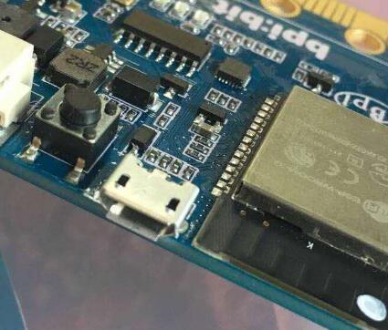

2. 通过2Pin电池插座供电，可以通过锂电池，电池组等来对板子进行供电，接口有防呆设计，不用担心电源接反的问题。

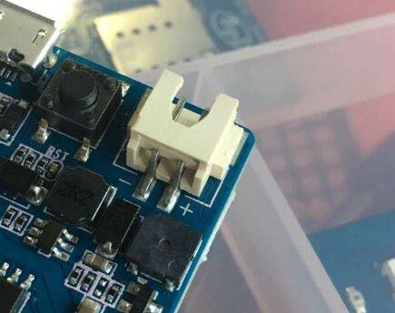

3. 通过金手指进行供电，板子下端的金手指包含了电源接口，可以作为输入或者输出功能。

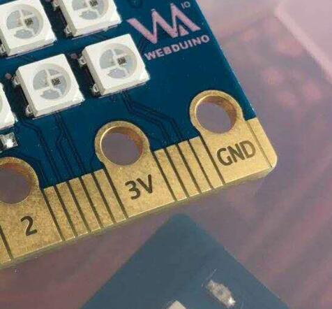

- 在电源接通之后，在进入到使用Webduino图形化编程之前还有一个步骤需要操作一下。那就是对板子进行设置与Wi-Fi连接。

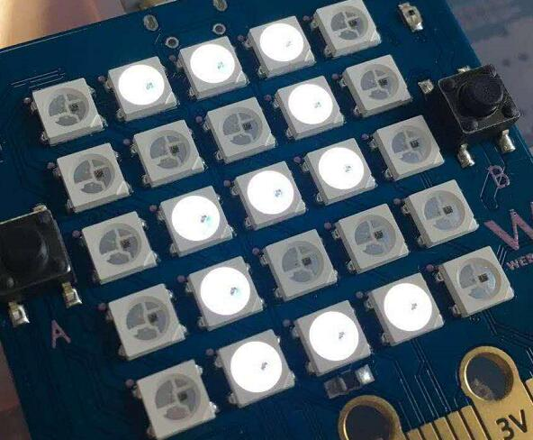

- BPI:Bit 接上电源后，会先以白色光显示四位数编码，这是为了区别自己与别人的板子，然后会开始闪烁红光，这个时候，我们使用一台可以连接Wi-Fi网络的设备如电脑、平板甚至是手机来搜索Wi-Fi网络，这是可以看到[bitxxxx](xxxx表示刚接通电源后看到的四位数字)，然后输入默认密码[12345678]进行联机。

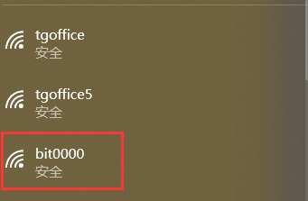

- 然后打开浏览器，在地址栏里面输入「192.168.4.1」(这里是BPI:Bit Webduino设置页面)

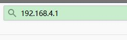

- 上面除了「必须」设定的所在场所的 Wi-Fi 名称与密码，也可以设定bit板在 Wi-Fi 搜索中所显示的名称 和密码 ( 避免其他人使用默认密码对你bit板的误控制)，Device ID 是 Bit 出厂时配发唯一 ID，无法填写与修改，也不会与其他人重复，下方还有个 `Server` 的选项，请选择「**China**」（这里对应的是大陆版本的固件）。最后点击**SUBMIT**

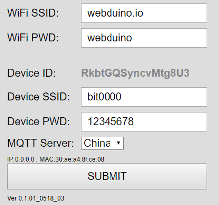

- 点击SUBMIT之后，会跳出一个新页面，并有SAVE OK 的字样表示设置成功，此时Bit开发板会重启并闪烁红灯，当红灯熄灭，且绿灯亮起一次之后，表示 Bit 开发板已经成功连接到环境内的Wi-Fi。 ( 若红灯持续闪烁或恒亮，请移除电源，重新操作联网与设置步骤)

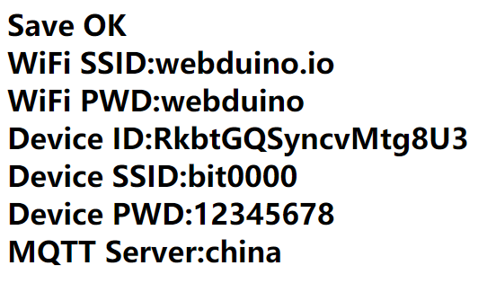

- 在BPI:Bit板连接Wi-Fi之后，我们还会在附近的Wi-Fi里面看到的它的SSID，只不过后面多了一串数字，这串数字就是它的最新获取到的IP地址，我们可以直接在浏览器输入这个地址对他进行设置，而不需要再去连接它的Wi-Fi。

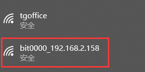

- 接下来呢来就是实际使用Webduino进行操控BIT开发板了，我们可以在[Webduino blockly页面](https://bit.webduino.com.cn/blockly/?lang=zh-hans)进行编程，然后通过堆叠积木的方式来实现你的想法。

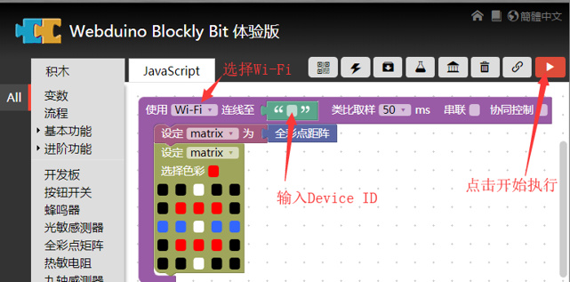

如果您手里还有没有BPI-BIT板子，但是想了解Webduino积木编程，也可以使用模拟器进行编程。具体操作步骤：
- 省去前面的链接WiFi的步骤，直接打开网页即可。
- 在选择`Wi-Fi`处选择`模拟器`，后面`Device ID`处填写**1234**。
- 打开**模拟器区域**,点击图标即可，位置如下所示。
- 开始你的积木编程，然后右上角的红色图标开始执行
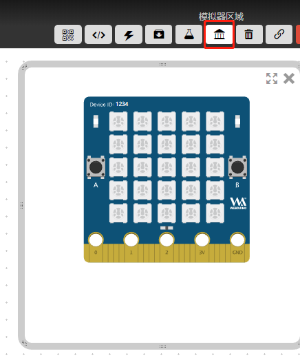